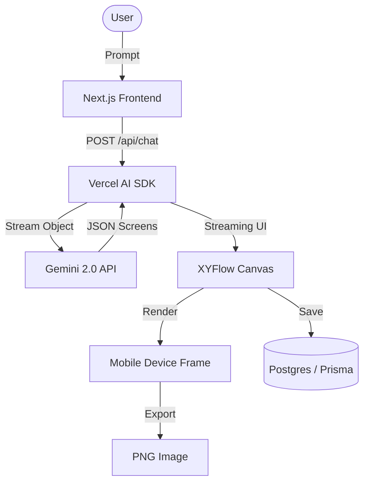

# Architecture: Xdesign.ai

## System Overview

## Technical Decisions

### 1. Vercel AI SDK (Stream Object)
We use `streamObject` to allow the user to see the design evolve in real-time. Instead of waiting for the full response, the canvas adds nodes as soon as the schema is partially fulfilled.

### 2. XYFlow (React Flow)
Chosen for its flexibility in handling custom nodes. It allows us to treat a complex mobile device mockup as a single draggable entity on an infinite plane.

### 3. Glassmorphism Design System
Following the `ui-ux-pro-max` search result, we implemented a layered glass system using backdrop-blur and semi-transparent borders to create a premium, high-tech feel suitable for an AI tool.

### 4. Prisma 7 Output Path
The client is generated into `src/generated/prisma` to ensure compatibility with modern bundlers and strict directory structures.
